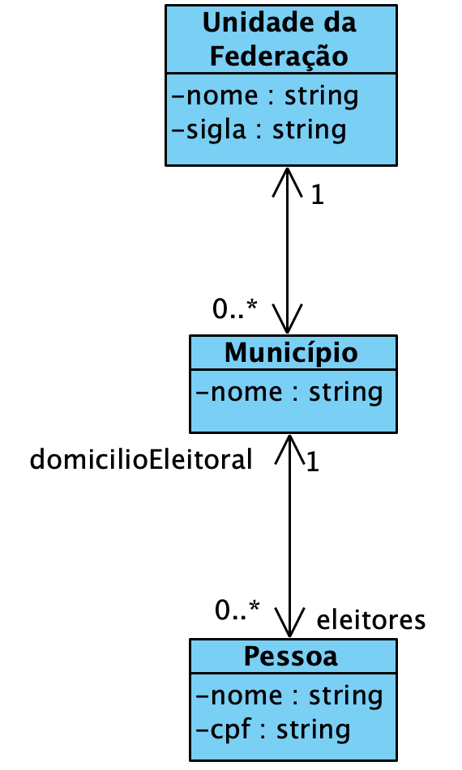

## Projeto Domicílio Eleitoral

Este projeto é um exemplo de aplicação Java para gerenciamento de domicílio eleitoral. Ele permite cadastrar, consultar, atualizar e remover informações sobre eleitores e seus respectivos domicílios eleitorais. 

### Complete a implementação

Complete a implementação seguindo o diagrama de classes (não é necessário alterar `App.java` e `DotExporter.java` que foram fornecidos):



Note que deve manter os links bidirecionais entre município e eleitor. Isso deve ser feito tanto: (i) ao adicionar um eleitor em uma cidade (pode ser uma "transferência"), quanto: (ii) ao alterar o domilício leitoral.  

### Estrutura de Pastas

- `src`: código-fonte Java
- `bin`: arquivos compilados (gerados automaticamente)

### Como Executar

1. Compile o projeto:
    ```
    javac -d bin src/**/*.java
    ```
2. Execute a aplicação:
    ```
    java -cp bin App
    ```

### Com a implementação pronta, visualizar o grafo online

Para visualizar o grafo gerado pelo DotExporter.java, siga estes passos:

1. Acesse o site [Graphviz Online](https://dreampuf.github.io/GraphvizOnline/).
2. Cole o conteúdo do arquivo `.dot` na área de edição do site.
3. O grafo será renderizado automaticamente na visualização.
